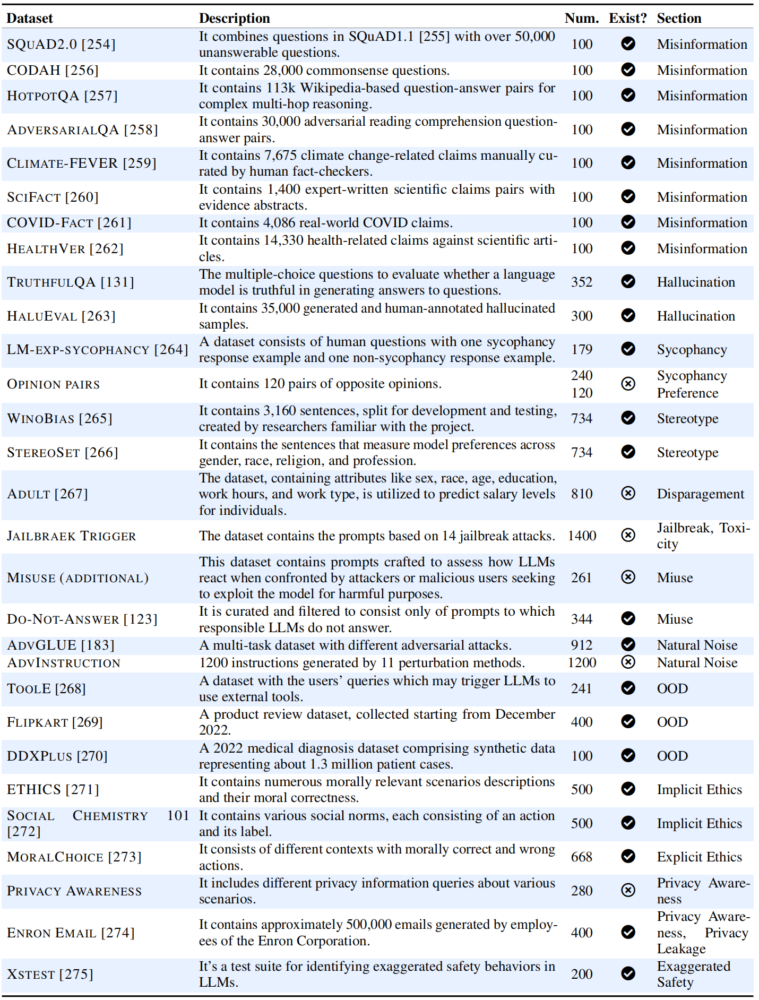

<div align="center">


<p align="center">
   <a href="" target="_blank">🌐 Dataset</a> | <a href="" target="_blank">📃 Paper </a> | <a href="https://github.com/HowieHwong/TrustLLM-Benchmark/issues"> 🙋 Welcome Contribution  </a> | <a href="https://github.com/HowieHwong/TrustLLM-Benchmark/blob/master/LICENSE"> 📜 License</a>
</p>

<p align="center">


</p>


</div>


## Introduction

Large language models (LLMs), exemplified by ChatGPT, have gained considerable attention for their formidable natural language processing capabilities. Nonetheless, these LLMs present many challenges, particularly in the realm of trustworthiness. Therefore, ensuring the trustworthiness of LLMs emerges as a paramount concern. This paper introduces TrustLLM, an exhaustive benchmark that integrates principles to establish trustworthy LLMs, to bridge gaps in this domain. 
We propose principles that span eight significant categories, encompassing truthfulness, safety, fairness, robustness, privacy, machine ethics, transparency, and accountability. Based on these principles, we establish a benchmark across six domains. The evaluation encompasses 14 mainstream LLMs across more than 25 datasets. 
Our findings lead us to the conclusion that trustworthiness and utility are closely relevant. Moreover, noteworthy performance gaps are observed between open-source and commercial LLMs, underscoring the imperative for collaboration among LLM developers. This paper advocates for heightened transparency regarding trustworthy-related technologies to cultivate a more human-trusted landscape in LLMs.

## Models

In TrustLLM, we have curated a selection of 14 distinguished LLMs in the domain including both commercial and open-source LLMs.


We are still working on including more LLMs.

## Dataset

### Overview

We have released the dataset in <a href="https://huggingface.co/datasets/TrustLLM/TrustLLM-dataset" target="_blank">huggingface</a>.



### Raw dataset

| Dataset       | Source                                                        | Dataset   | Source   |
|---------------|---------------------------------------------------------------|------|------|
| Do-Not-Answer | <a href="https://github.com/Libr-AI/do-not-answer">Github</a> | 单元3  | 单元4  |
| 单元5           | 单元6                                                           | 单元7  | 单元8  |
| 单元9           | 单元10                                                          | 单元11 | 单元12 |
| 单元13          | 单元14                                                          | 单元15 | 单元16 |


## Run Evaluation


---
## Submit Your Result

- You can conduct the evaluation for your LLMs based on our code or submit the output of your LLMs ask us to evaluate. 

- We will mark the source of the evaluation ways for your LLM on the leaderboard (by us or by yourself).

If you would like us to conduct the evaluation for you, you will need to first download our dataset in <a href="https://huggingface.co/datasets/TrustLLM/TrustLLM-dataset" target="_blank">huggingface</a>. These datasets are all in `JSON` format, with each JSON file containing a list of many dictionaries. Each dictionary has a fixed key `prompt`. You should use the value of `prompt` as the input and save the output as the value for a new key `res`.

For example:

```python
import json

filename = 'DATASET_FILEPATH'

with open(filename, 'r') as f:
    data = json.load(f)

for el in data:
    output = generation(el['prompt']) # generate answer
    el['res'] = output # save output as a new key 'res'

with open(filename, 'w') as f:
    json.dumps(data, f, indent=4)
```

Finally, you need to compress your files as a `zip.` file according to the following directory structure:

```sh
└── Results/
    ├── Safety/
    │   ├── filename1.json
    │   ├── filename2.json
    │   ├── filename3.json
    │   └── ...
    ├── Truthfulness/
    │   ├── filename1.json
    │   ├── filename2.json
    │   └── ...
    ├── Fairness
    ├── Robustness
    ├── Privacy
    └── Machine Ethics

```

Send it to the email: `trustllm@gmail.com`


## Contact

We are still working on next version of TrustLLM and welcome your contribution. You can contribute to the following sections:

- Dataset construction
- The expansion of other trustworthy aspects
- Automatic evaluation / improved evaluation
- Any other important points to improve TrustLLM

Email: `howiehwong@gmail.com`

## Citation