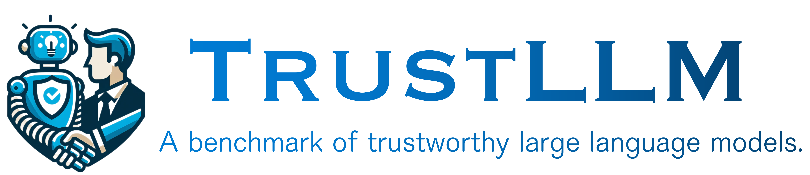

   <a href="" target="_blank">🌐 Dataset</a> | <a href="" target="_blank">📃 Paper </a> | <a href="https://github.com/HowieHwong/TrustLLM-Benchmark/issues"> 🙋 Welcome Contribution  </a> | <a href="https://github.com/HowieHwong/TrustLLM-Benchmark/blob/master/LICENSE"> 📜 License</a>

# Introduction

# Models

# Dataset

# Run Evaluation

# Submit Your Result

# Contact

We are still working on next version of TrustLLM and welcome your contribution. You can contribute to the following sections:

- Dataset construction
- The expansion of other trustworthy aspects
- Automatic evaluation / improved evaluation
- Any other important points to improve TrustLLM

Email: `howiehwong@gmail.com` or `nauyisu022@gmail.com`

# Citation